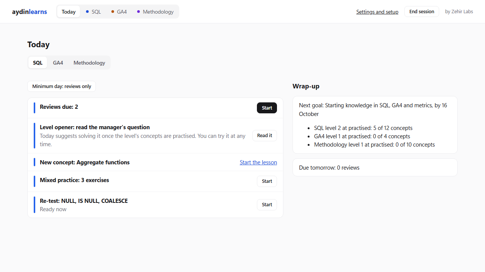
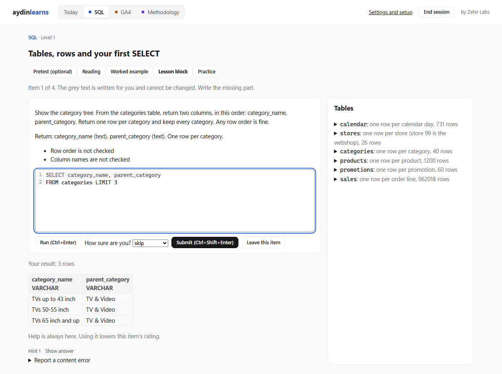
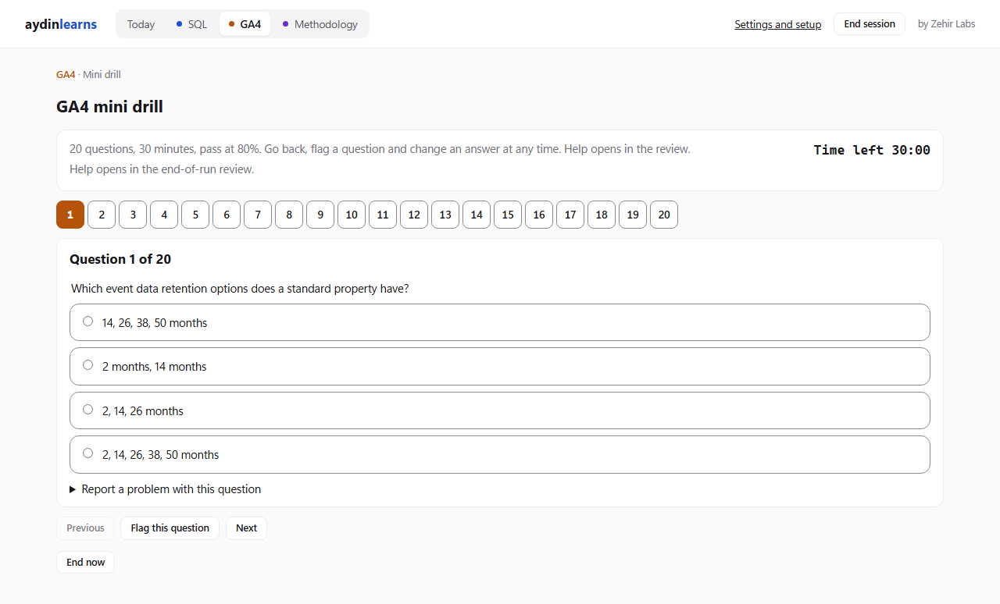

# aydinlearns

A local study app for getting hired as a data, marketing or commercial analyst. It covers the
three things recruiters test: **SQL**, **GA4** (Google Analytics 4) and **analytics methodology**
(metrics, A/B testing, statistics and pricing). Every query the learner writes runs on a real
database and is graded on its result, and the app names the mistake ("you averaged the ratios") instead of only
saying "wrong".

## What can be studied now

| Section | Content |
|---|---|
| SQL | Levels 1 to 3, 20 concepts from the first SELECT to aggregation, CASE, types, dates, joins, CTEs and set operations: lessons with worked examples, 568 exercises (write the query, fix the query, predict the result, choose the query), timed drills, 12 cases in an inbox (an opener for each level, seven daily cases and two pricing cases), mistake cards for the mistakes that keep coming back, "other ways to write this" after a pass, a dataset explorer and a portfolio export |
| GA4 | Complete for the certification: 16 lessons and 123 questions (73 for practice and 20-question mini drills, 50 held out for 25-question half-mocks and 50-question full mocks), a readiness check, and 10 interview labs in Google's GA4 demo account, each re-checked a week later |
| Methodology | 78 concepts, each with a reading: 51 metrics (marketing, retail, pricing and SaaS), 13 on experiments and A/B testing, 9 on statistics and 5 on pricing economics. 478 questions, 93 of them held out for mocks |

## How it teaches

- **Graded on results, not on text.** The learner's SQL runs in DuckDB on a fictional
  retailer's data (Voltmarkt, about 960,000 order lines) and on a hidden edge-case dataset. The
  grader compares results inside DuckDB with a precision per column type, and shows a checklist:
  shape, grain, values and edge cases.
- **Spaced repetition** with FSRS-6. Reviews come back when they are due. A concept counts as
  mastered only after unaided first-try solves in mixed practice, on different days.
- **Nothing is locked.** Hints and "show answer" are always there; using them lowers that item's
  rating. Inside a timed drill or mock, help waits for the review at the end.
- **Goals, not hours.** Progress is measured against milestones and target dates, never study
  time.
- **Exam practice.** GA4 half-mocks and full mocks draw unseen held-out questions and follow a
  21-day retake rule, with a score per exam topic. A readiness check (advice only) shows when the
  mocks and every exam topic are at the pass level.
- **Interview labs.** Ten GA4 tasks done in Google's demo account. The app stores no reference
  numbers, because the demo data changes daily: it checks the values against each other, and
  asks for the same screen again a week later.

| An SQL exercise | A GA4 mini drill |
|---|---|
|  |  |

A lesson reading: [docs/screenshots/lesson.png](docs/screenshots/lesson.png).

## How it is built

- **A local web app.** React 19 and Vite for the screens; a Hono server on `127.0.0.1` in
  Node 24, written in TypeScript and run directly. The app makes no calls outside the laptop.
- **Safe SQL.** The learner's SQL runs in a separate child process on a read-only copy of the
  database, after a gate that accepts exactly one SELECT statement, with a timeout.
- **The log is the source of truth.** Every attempt is appended to JSONL files, and the
  learner's state (review cards, concept states, readiness) is replayed from them.
- **Generated data.** The course database is built in Python and DuckDB from a written
  specification, from fixed seeds, so every build is the same.
- **A reusable core.** `core/` holds the domain-free engine (the log records, the scheduler,
  replay and the exam engine), so a sister app for learning Dutch can reuse it.

## How it was made

Aydin designed and directed the project and built it with AI coding agents (Claude Code), from a
written design, sprint plans and test-first tasks, with a review per task and an outside review
of every pull request. Lessons and exercises are generated from a research bank by agents and
checked before they ship: 14,994 automated content checks, and a blind solver (a fresh agent
that solves every exercise without seeing its answer key). The design, the plans, every ruling
and the review logs are in `docs/`.

Today: 1,944 automated tests, 96 data pipeline tests, 14,994 content checks and a 63-row browser smoke test, all passing.

## Status

Version 1.1 (2026-10-09). Built: SQL levels 1 to 3 with the scheduler, Today, drills, level
openers, cases and the inbox, mistake cards, the portfolio export, the Progress screen, the
dataset explorer and screen mode; GA4 complete (lessons, mini drills, half-mocks, full mocks,
the readiness check and the interview labs); Methodology complete. Later 1.x releases add SQL
levels 4 to 7, more companies and real datasets, and the recruiter mocks. See
`docs/planning/roadmap.md` and `CHANGELOG.md`.

It runs on Windows 11; other systems are untested.

## Licence

Source-available, for noncommercial use with credit: the code under the PolyForm Noncommercial
License 1.0.0 (`LICENSE`), the content and documentation under CC BY-NC 4.0
(`LICENSE-CONTENT.md`). `NOTICE.md` lists which files fall under which, and the parts that belong
to others. Not affiliated with Google.

## Where things are

aydinlearns grew inside a private monorepo. Links in the docs that start with `../` point to
shared files there and are not part of this repository.

| Path | What it is |
|---|---|
| `CLAUDE.md` | Working rules and locked decisions for coding agents |
| `docs/planning/roadmap.md` | Start here before any sprint: every sprint's contents, jobs and "done when", and the rules for every sprint |
| `docs/planning/2026-10-03-build-handoff.md` | What the first build sprint did, what is open, and what slices 1b and 2a inherit; detail behind the roadmap's sprint 2 |
| `docs/planning/2026-10-03-build-record.md` | Every ruling made during the first build, and every deferred finding |
| `docs/superpowers/specs/2026-10-01-aydinlearns-v1-design.md` | The v1 design: what gets built, in which order, and why |
| `docs/superpowers/plans/2026-10-02-aydinlearns-slice-0-1a.md` | The implementation plan for slice 0, spike A and slice 1a, with a roadmap for 1b, 2a and 2b |
| `knowledge/` | The research knowledge bank the app content is built from. Start with `knowledge/README.md`. Never edited; fixes go in `knowledge/ERRATA.md` |
| `docs/planning/2026-10-05-spike-a.md` | Spike A: the DuckDB and server facts checked on this laptop before the SQL runner was built |
| `docs/content/prompt-style-guide.md` | How exercise prompts are written |
| `docs/content/generator-brief.md`, `docs/content/blind-solver.md` | How lessons and exercises are generated with agents, and how the blind solver checks them |
| `docs/planning/2026-10-01-knowledge-read-issues.md` | Issues found while reading the knowledge bank in full, sorted into ERRATA in slice 0 |
| `docs/planning/2026-10-02-methodology-review.md` | The SQL-teacher, edtech and hiring review of the design, with its research evidence |
| `docs/research_prompts.md` | The prompts that produced the knowledge bank |
| `docs/reviews/codex-findings.md` | Pull-request review findings |
| `CHANGELOG.md` | What changed and when |
| `LICENSE`, `LICENSE-CONTENT.md`, `NOTICE.md` | The licences, and which files fall under which |
| `tools/export-public.sh` | Refreshes the public copy of this folder (see the script's header) |

The app itself:

| Path | What it is |
|---|---|
| `core/` | Domain-free engine code: the log records, events and goals. aydindutch copies it later |
| `schemas/` | The app's types (exercises, keys, lessons, curriculum, the log extension) and the grading test cases |
| `server/` | The local server: the SQL runner (`server/runner/`), the grader (`server/grader/`), the logs and the routes |
| `web/` | The screens: Today, the maps, lessons, exercises, timed runs, and settings and setup |
| `content/` | The SQL, GA4 and Methodology curricula, lessons and exercises, and their answer keys (`content/keys/`) |
| `pipeline/` | The Python build for the Voltmarkt course database |
| `tools/` | The content checks, the ERRATA check, the import check, the curriculum extractor, the blind-solver tools and the launcher (`tools/launch.ts`) |
| `tests/` | The test suite, plus the browser smoke test in `tests/e2e/` |
| `data/`, `logs/` | The built course database and the attempt log. Git ignores both; the log is backed up to the folder chosen in Settings after each session |

Design §11 has the full layout.

## Run and ship

You need Node 24.12 or later, and the Python environment in `pipeline/.venv` for the data build.

To study, double-click `Start aydinlearns.bat`. It sets up anything missing or out of date
(the packages, the Python environment, the course database, the screens), starts the app and
opens http://127.0.0.1:5174 in your browser. Keep its window open while you study; close it or
press Ctrl+C to stop, and the session ends and the backup runs first. If the app is already
running, it just opens the browser. The only thing it cannot install is Node.js 24 itself, and
Python 3.11 or later the first time the data is built. A first run on a new machine downloads the
npm and Python packages.

The same by hand:

| Command | What it does |
|---|---|
| `npm start` | Starts the app. Open http://127.0.0.1:5174. To run a second copy beside it, set `AYDINLEARNS_PORT` to another port from 1024 to 65535 |
| `npm run dev:server` with `npm run dev:web` | For development, each in its own terminal: the server restarts on every change, and Vite serves the screens on http://localhost:5173 |

To check and build from clean, run these in order:

| Command | What it does |
|---|---|
| `npm ci` | Installs the exact package versions from the lockfile |
| `pipeline/.venv/Scripts/python.exe -m unittest discover -s pipeline/tests -v` | Tests the data pipeline |
| `npm run build:data` | Builds `data/course.duckdb` and its manifest. It also writes the case truth checkpoints (`data/truth/voltmarkt.json`, key `checkpoints`). Run it after any change to the pipeline or the case data |
| `npm run typecheck` | Type-checks the server, tools, tests and screens |
| `npm test` | Runs the test suite |
| `npm run check:imports` | Checks that `core/` stays free of app code |
| `npm run check:errata` | Checks `knowledge/ERRATA.md` |
| `npm run check:content` | Runs the content checks on every lesson and exercise, including the blind solver records |
| `npm run build:web` | Builds the screens into `web/dist`, which `npm start` serves |
| `npm run test:e2e` | The browser smoke test. It starts its own server on port 5174, or on `AYDINLEARNS_PORT` when that is set, so stop `npm start` first or use another port. It starts from an empty temporary log and never writes to the real `logs/` |

For generating content (see `docs/content/`):

| Command | What it does |
|---|---|
| `npm run extract` | Rebuilds the curriculum and error catalogue in `content/sql/` from the knowledge bank and ERRATA |
| `npm run export:solver-view` | Writes the prompt-only view of every exercise for the blind solver (`docs/content/blind-solver.md`) |
| `npm run extract:ga4` | Builds the GA4 bank in `content/ga4/` from knowledge files 06 and 10 and ERRATA. Run it only to rebuild the bank from scratch |
| `npm run export:choice-view` | Writes the stem-and-options view of every GA4 and Methodology item for the choice blind solver. Run it before a blind solve |
| `npm run record:choice-solver` | Grades the choice blind solver's answers and records the right ones in the answer keys. Run it after a blind solve |
| `npm run export:lab-view` | Writes the view of every GA4 lab's structural parts (no keys) for the lab blind solver, in `tools/.solver-view/labs/` |
| `npm run record:lab-solver` | Grades the lab blind solver's answers and records them in the lab keys. Run it after a lab blind solve |
| `node tools/reserve-held-out.ts` | Reserves the held-out mock pool for GA4 and Methodology (`content/<section>/held-out.json`). Run it when the bank changes, then `npm run check:content`. `--extend --candidates <file> (--per-card <k> or --topic <T> --count <n> [--release-from <T1,T2>]) [--logs <dir>]` adds only the listed new items and releases only never-served held items, never moving a practised one. A candidate that is not in the bank or is already held refuses the run; an ineligible one is skipped and counted |
| `npm run record:solver` | Grades the blind solver's answers and records them in the answer keys |
| `npm run report:window` | Prints, per SQL concept, the first attempts in its mastery window by kind, how many qualify, and the concept's state. Counts only. Reads `logs/`, or the folder given after `--`; writes nothing |
